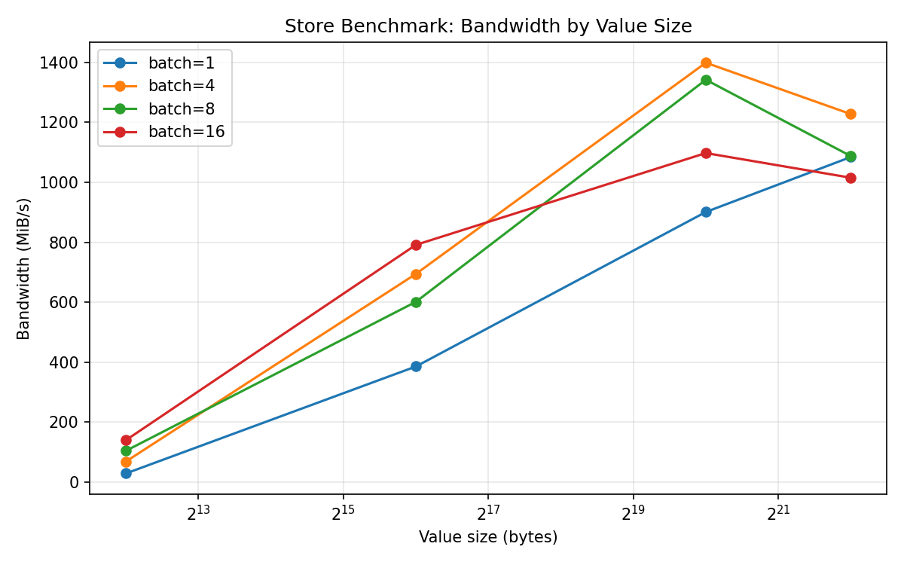
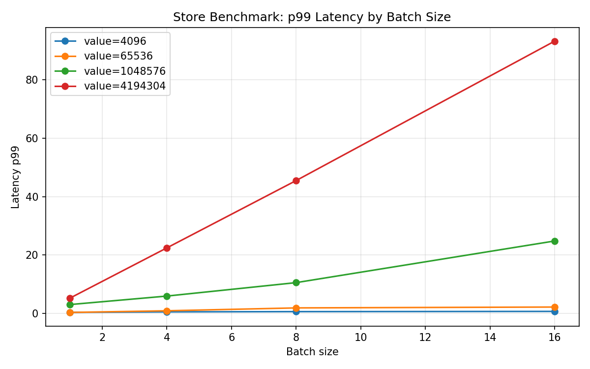
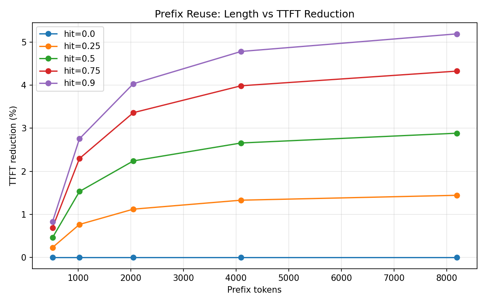
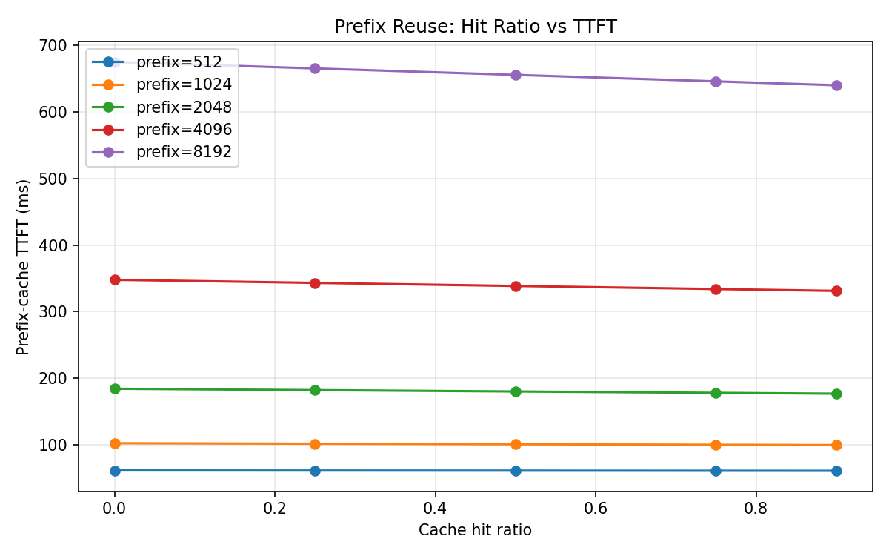
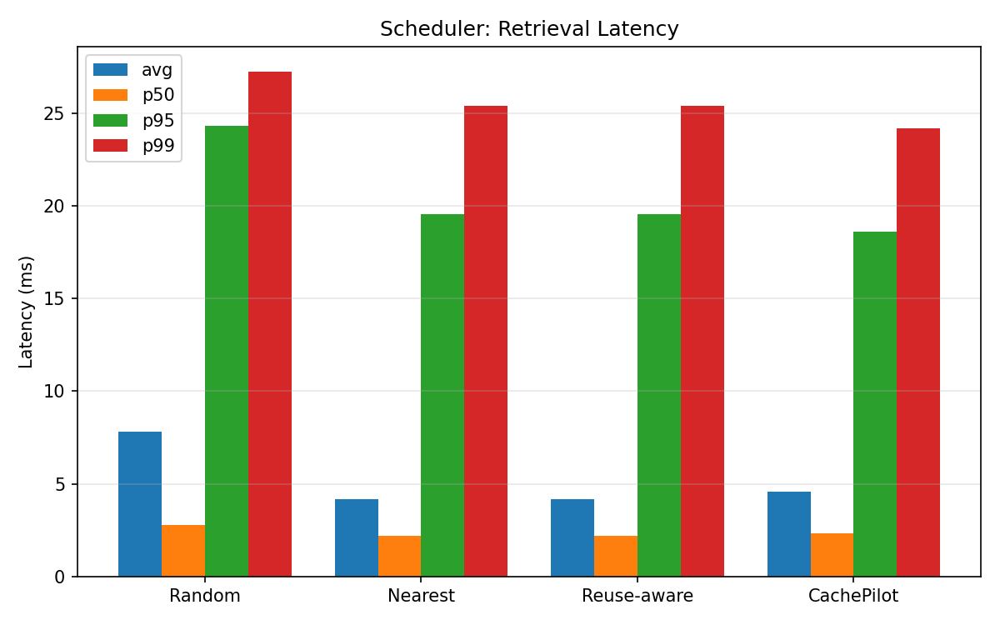
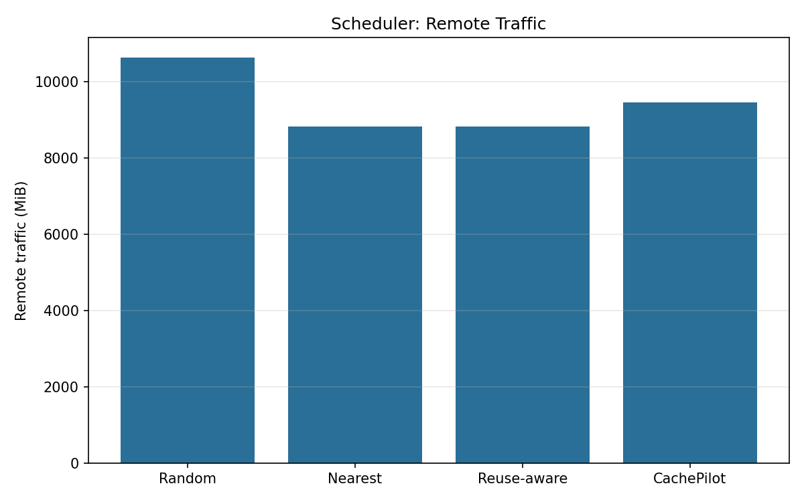
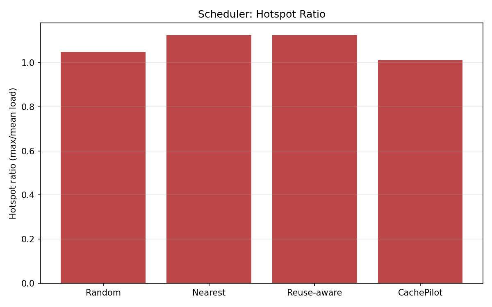

# CachePilot

### 基于 Mooncake 的 KVCache 复用与调度评测系统

<p align="center">
  
</p>

<p align="center">
  <b>真实 Mooncake Store 实机实测</b> · AutoDL RTX 4090 · TCP · 峰值带宽 <code>1399.08 MiB/s</code>
</p>

<p align="center">
  <a href="#真实实测结果摘要">实测结果</a> ·
  <a href="#dashboard-可视化演示">Dashboard</a> ·
  <a href="#如何运行">快速开始</a> ·
  <a href="DESIGN.md">设计文档</a> ·
  <a href="EVALUATION.md">评测文档</a>
</p>

---

## 项目简介

**CachePilot** 是 2026 Mooncake 赛题参赛作品：一个**非侵入式** KVCache 评测套件。

它以 Mooncake 官方 Store Benchmark 为真实底座，通过封装 `store_kv_bench.py` 完成真实 Mooncake Store 的 put/get/`read_perf` **实机测试**，并扩展 Prefix Reuse 可控 workload 评估与 Retrieval Scheduler 离线策略评估。系统统一输出 CSV、日志、图表，并提供 Streamlit Dashboard 用于演示与截图。

**不修改 Mooncake 核心代码。** 真实调用链路：

```text
mooncake_master → HTTP metadata → MooncakeDistributedStore
  → store_kv_bench.py → mooncake_store_runner.py → results/ → dashboard.py
```

| 模块 | 性质 | 说明 |
|------|------|------|
| Store Benchmark | **真实实机实测** | 官方 `store_kv_bench.py` + `MooncakeDistributedStore` |
| Prefix Reuse Evaluation | 可控 workload 评估 | prefix length × hit ratio → TTFT 改善趋势 |
| Retrieval Scheduler Evaluation | 离线策略评估 | Random / Nearest / Reuse-aware / CachePilot |

---

## Dashboard 预览

Streamlit 演示界面，适合比赛录屏与文档截图。

### Store Benchmark — 真实 Mooncake Store 实测

<p align="center">
  
</p>

> 带宽随 value size 上升，峰值约 **1399 MiB/s**（1MB, batch=4）；大对象高 batch 下 p99 明显升高。

### Retrieval Scheduler — 策略评估对比

<p align="center">
  
</p>

> 对比 Random / Nearest / Reuse-aware / CachePilot 的延迟、远程流量与热点比。

### 启动 Dashboard

```bash
cd CachePilot
python3 -m venv .venv && source .venv/bin/activate
pip install -r requirements.txt
bash scripts/run_dashboard.sh
# Windows: scripts\run_dashboard.bat
```

浏览器打开 [http://localhost:8501](http://localhost:8501)（服务器请使用外部映射地址）。

---

## 真实实测结果摘要

**环境：** AutoDL · RTX 4090 24GB · 16 核 / 120GB · Ubuntu 22.04 · Python 3.10 · CUDA 11.8 · `mooncake-transfer-engine-non-cuda` · **TCP**

### verify_write — `return_code=0`

| req/s | kv/s | MiB/s | p50 | p95 | p99 | misses | verify_failures |
|------:|-----:|------:|----:|----:|----:|-------:|----------------:|
| 2482.98 | 9931.94 | 38.8 | 0.260 ms | 0.718 ms | 0.781 ms | **0** | **0** |

### read_perf — 16 组全部 `return_code=0`

| value_size | batch | MiB/s | p50 | p99 |
|------------|------:|------:|----:|----:|
| 4KB | 1 | 28.78 | 0.106 ms | 0.380 ms |
| 4KB | 16 | 139.86 | 0.352 ms | 0.703 ms |
| 64KB | 4 | 694.43 | 0.304 ms | 0.917 ms |
| **1MB** | **4** | **1399.08** | 2.574 ms | 5.956 ms |
| 4MB | 4 | 1227.74 | 12.251 ms | 22.456 ms |
| 4MB | 16 | 1015.36 | 52.517 ms | **93.267 ms** |

<p align="center">
  
  
</p>

<p align="center">
  <sub>左：真实 Store 带宽 · 右：真实 Store p99 延迟</sub>
</p>

---

## 策略评估图表

<p align="center">
  
  
</p>

<p align="center">
  
  
  
</p>

---

## 赛题对应关系

| 赛题关注点 | CachePilot 模块 | 说明 |
|-----------|-----------------|------|
| Mooncake Store 性能 | `mooncake_store_runner.py` | 真实调用官方 bench，实测 `MooncakeDistributedStore` |
| KVCache 复用 | `prefix_reuse_benchmark.py` | 可控 Prefix Reuse workload 评估 |
| 检索 / 调度优化 | `retrieval_scheduler_sim.py` | Retrieval Scheduler 策略评估 |
| 可复现实验 | `scripts/run_all.sh` + Dashboard | CSV / PNG / log + 可视化演示 |

---

## 目录结构

```text
CachePilot/
├── README.md / DESIGN.md / EVALUATION.md
├── dashboard.py                 # Streamlit 演示界面
├── requirements.txt
├── benchmark/                   # Store wrapper + 策略评估 + 绘图
├── scripts/
│   ├── run_all.sh
│   ├── run_dashboard.sh         # Linux / Git Bash
│   └── run_dashboard.bat        # Windows
├── docs/screenshots/            # Dashboard 截图
└── results/
    ├── csv/                     # 真实实测 + 评估 CSV
    ├── logs/
    └── figures/                 # 带宽 / 延迟 / TTFT / 调度图
```

---

## 安装与运行

```bash
cd CachePilot
python3 -m venv .venv
source .venv/bin/activate          # Windows: .venv\Scripts\activate
pip install -r requirements.txt
```

依赖：`numpy` · `pandas` · `matplotlib` · `streamlit`  
Store 实测另需 Mooncake Python binding（本实验：`mooncake-transfer-engine-non-cuda`）并启动 master。

### 设置 MOONCAKE_ROOT

```bash
export MOONCAKE_ROOT=/path/to/Mooncake
# 或: python benchmark/mooncake_store_runner.py --mooncake-root /path/to/Mooncake ...
```

未指定时自动尝试 `../Mooncake`、`../../Mooncake`、`/root/autodl-tmp/mooncake_competition/Mooncake`。

### 启动 Mooncake master

```bash
mooncake_master \
  --enable_http_metadata_server=true \
  --http_metadata_server_host=0.0.0.0 \
  --http_metadata_server_port=8080 \
  --eviction_high_watermark_ratio=0.95
```

| 参数 | 本实验值 |
|------|----------|
| metadata-server | `http://HOST_IP:8080/metadata` |
| master-server | `HOST_IP:50051` |
| protocol | `tcp` |

### 一键全流程

```bash
export MOONCAKE_ROOT=/path/to/Mooncake
bash scripts/run_all.sh
bash scripts/run_dashboard.sh
```

---

## 输出文件

| 路径 | 说明 |
|------|------|
| `results/csv/store_verify_real.csv` | 真实 verify_write |
| `results/csv/store_benchmark.csv` | 真实 read_perf（16 组） |
| `results/csv/prefix_reuse.csv` | Prefix Reuse 评估 |
| `results/csv/retrieval_scheduler.csv` | Scheduler 策略评估 |
| `results/figures/*.png` | 带宽 / 延迟 / TTFT / 调度图 |
| `docs/screenshots/*.png` | Dashboard 演示截图 |

---

## 当前限制

1. **非侵入**：不修改 Mooncake 核心，Store 依赖官方 bench 与 `MooncakeDistributedStore`。
2. **Prefix / Scheduler** 为离线策略评估，不作为端到端集群 LLM serving 性能声明。
3. Store 实测需 `mooncake_master` + Mooncake Python binding。
4. 当前实机验证为**单机 TCP**；RDMA / 多机待扩展。

---

## 后续计划

- 扩展 `fill` / `write_perf` / `mixed_rw` / `zcopy` 一键矩阵
- 用真实 Store get 延迟标定 Prefix Reuse 参数
- 扩展 CachePilot 调度分数（副本、带宽预算、拓扑）
- 多机 / RDMA 联合评测

---

## License

2026 Mooncake 赛题参赛作品。Mooncake 本体请遵循其上游许可证。
